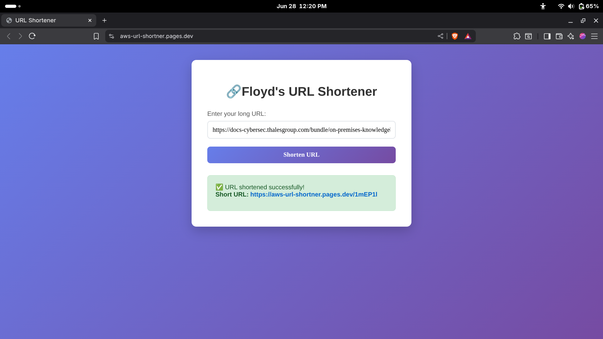

# 🔗 AWS Serverless URL Shortener

A fully serverless URL shortener built using **AWS Lambda**, **API Gateway**, **DynamoDB**, and **Cloudflare Pages** — with no EC2 or servers to manage!

---

## 🌐 Live Demo

👉 Try it here: [aws-url-shortner.pages.dev](https://aws-url-shortner.pages.dev)

---

## 🚀 Features

- Generate custom short URLs using a clean UI
- Built with a fully serverless backend on AWS
- Instant redirects using Cloudflare Worker + API Gateway
- Secure, fast, and zero-infrastructure setup

---

## 🛠️ Tech Stack

### Frontend
- **HTML/CSS/JS** (static site)
- Hosted on **Cloudflare Pages**
- Calls AWS backend via public API Gateway

### Backend
- **AWS Lambda** for logic
- **API Gateway** for endpoints
- **DynamoDB** for URL storage
- **Python** used in backend logic

### Edge Logic
- **Cloudflare Worker** for redirect handling based on shortcodes

---

## 📸 Preview

---

## 📦 How It Works

1. User enters a long URL in the frontend UI.
2. A POST request is sent to the API Gateway → Lambda → DynamoDB.
3. Lambda returns a short code (e.g., `Zx3Zm8`).
4. Cloudflare Worker listens on `https://aws-url-shortner.pages.dev/Zx3Zm8` and redirects to the original long URL via the API.

